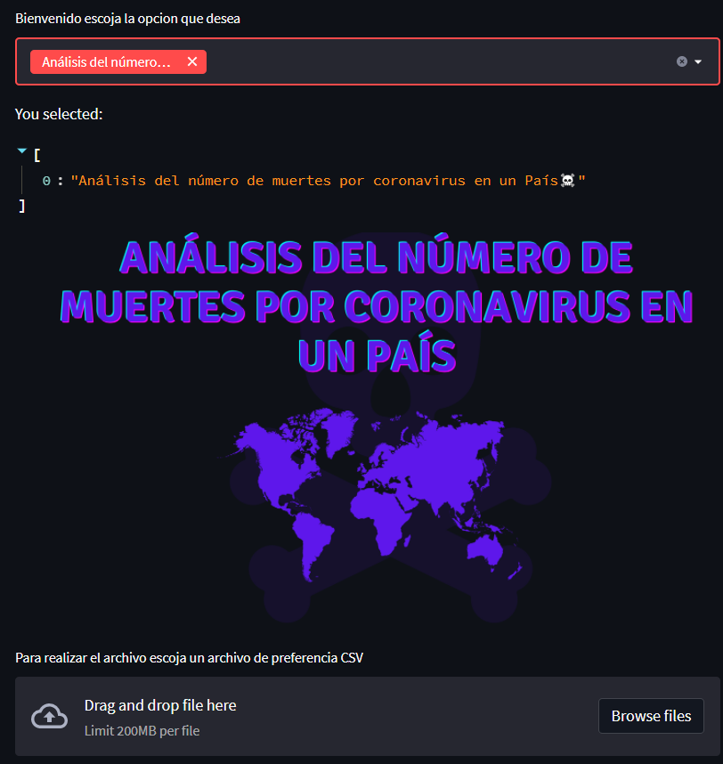

# ORGANIZACION DE LENGUAJES Y COMPILADORES 2
## Proyecto 2

---

### Universidad de San Carlos de Guatemala
### Escuela de vacaciones diciembre 2022
### Juan Diego Alvarado Salguero
### 201807335
### Manual Tecnico

---

# Views

:round_pushpin: [AbrirDataFrame](#id2)
:round_pushpin: [Parametrizacion de Variables](#id3)

:round_pushpin: [Metodo Isin()](#id4)
:round_pushpin: [Metodo drop_duplicates()](#id5)
 
 
# Reportes

## :beginner: De esta manera es como la aplicaion abri un archivo csv  con la ayuda de la libreria pandas , esto es de gran ayuda ya que guarda el archivo csv en la  variable dataframe gracias a ellos es que realizar el analisis es bastante sencillo

## :beginner: Para parametrizar las varaibles , la variable var  valga la redundancia es de suma importancia ya que la aplicacion le indica al usuario que  columna utilizar y  la opcion que el usuario se guarda en esa variable y gracias a eso es mucho mas facil ir parametrizando los valores  y asi obtener resultados

## :beginner: Este metodo propio de la librerias pandas , es quiza uno de los metodos mas importantes en todo el proyecto gracias a que ese metodo es posible obtener todos los valores posibles del pais o continente del que querremos obtener la informacion y posteriormete hacer el analisis

## :beginner: Este metodo su funcion en el proyecto es simplemente el de evitar valores repetidos , es decir que en el archivo csv que se desee cargar vendran siempre datos repetidos , entonces gracias a este metodo propio de la libreria pandas es posible evitar la data repetida y asi   poder mostrarle al usuario los datos que el desea escoger pero  sin data repetida

## :beginner: Prediccion de mortalidad por COVID en un Departamento

## :beginner: Analisis del numero de muertes por coronavirus en un pais

## :beginner: Tendencia de la vacunacion de un pais

## :beginner: Tendencia de casos confirmados de Coronavirus en un departamento de un pais

## :beginner: Prediccion de mortalidad por COVID en un pais 

## :beginner: Muertes promedio por casos confirmados y edad de covid 19 en un pais

## :beginner: Analisis comparativo entre 2 o mas paises o continentes

## :beginner: Analisis de vacunacion entre 2 paises

## :beginner: Muertes segun regiones de un pais - Covid 19

## :beginner: Predicciones de casos y muertes en todo el mundo

## :beginner: Tasa de comportamiento de casos activos en relacion al numero de muertes en un continente

## :beginner: Tasa de mortalidad por coronavirus (COVID-19) en un pais

## :beginner: Prediccion de casos de un pais para un anio

## :beginner: Prediccion de casos de un pais por dia

## :beginner: Prediccion de muertes en el ultimo dia del primer anio de infecciones en un pais

## :beginner: Factores de muerte por COVID-19 en un pais

## :beginner: Porcentaje de muertes frente al total de casos en un pais, region o continente

## :beginner: Porcentaje de hombres infectados por covid-19 en un pais desde el primer caso activo

## :beginner: Tendencia del numero de infectados por dias de un pais

## :beginner: Comparacion entre el numero de casos detectados y el numero de pruebas de un pais

# Flujo

1. Arrastrar el archivo al apartado correspondiente

2. Se muestran los resultados

3. Se pueden hacer filtros egún cada uno de los reportes solicitados.

